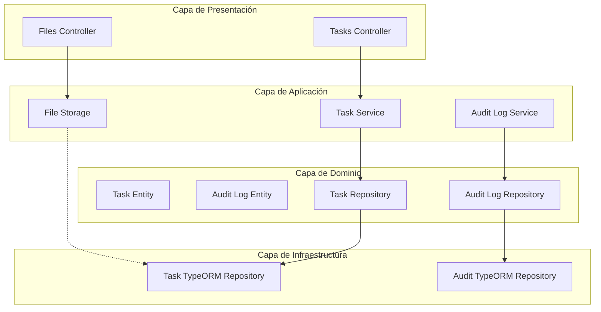

# Plan de Implementación: Mejoras del Sistema de Gestión de Tareas

## Resumen del Proyecto

Extender el sistema de tareas con funcionalidades avanzadas: paginación, filtrado, bitácora de auditoría y manejo de archivos.

## Arquitectura General



## Fase 1: Nuevos Campos y Entidades

### 1.1 Actualizar Task Entity

**Archivos a modificar:**

- [`src/context/tasks/domain/entities/task.entity.ts`](src/context/tasks/domain/entities/task.entity.ts)
- [`src/context/tasks/infrastructure/persistence/task.orm-entity.ts`](src/context/tasks/infrastructure/persistence/task.orm-entity.ts)

**Nuevos campos:**

```typescript
// En Task entity
isPublic: boolean;  // Obligatorio
filePath?: string;  // Opcional - ruta del archivo
fileName?: string;   // Opcional - nombre original
fileSize?: number;   // Opcional - tamaño en bytes
fileMimeType?: string; // Opcional - tipo MIME
```

### 1.2 Crear Audit Log Entity

**Archivos a crear:**

- [`src/context/tasks/domain/entities/audit-log.entity.ts`](src/context/tasks/domain/entities/audit-log.entity.ts)

```typescript
export class AuditLog {
  id: number;
  userId: string;
  action: 'CREATE' | 'UPDATE' | 'DELETE' | 'VIEW';
  entityType: 'TASK';
  entityId: number;
  oldValue?: string; // JSON string del valor anterior
  newValue?: string; // JSON string del valor nuevo
  ipAddress?: string;
  userAgent?: string;
  createdAt: Date;
}
```

## Fase 2: DTOs para Paginación y Filtrado

### 2.1 Crear PaginationQueryDto

**Archivo a crear:**

- [`src/context/tasks/application/dto/pagination-query.dto.ts`](src/context/tasks/application/dto/pagination-query.dto.ts)

```typescript
export class PaginationQueryDto {
  page?: number; // default: 1
  limit?: number; // default: 10, max: 100
  sortBy?: string; // campo para ordenar
  sortOrder?: 'ASC' | 'DESC';
  completed?: boolean; // filtro por estatus
  dueDateFrom?: string; // filtro por rango de fechas
  dueDateTo?: string;
  responsible?: string; // filtro por responsable
  tags?: string; // comma-separated
  isPublic?: boolean; // filtro por visibilidad
}
```

### 2.2 Crear PaginatedResponseDto

**Archivo a crear:**

- [`src/context/tasks/application/dto/paginated-response.dto.ts`](src/context/tasks/application/dto/paginated-response.dto.ts)

```typescript
export class PaginatedResponseDto<T> {
  data: T[];
  meta: {
    total: number;
    page: number;
    limit: number;
    totalPages: number;
    hasNextPage: boolean;
    hasPreviousPage: boolean;
  };
}
```

### 2.3 Actualizar DTOs existentes

**Archivos a modificar:**

- [`src/context/tasks/application/dto/create-task.dto.ts`](src/context/tasks/application/dto/create-task.dto.ts)
- [`src/context/tasks/application/dto/update-task.dto.ts`](src/context/tasks/application/dto/update-task.dto.ts)

Agregar validaciones para `isPublic` y archivo.

## Fase 3: Repositorios

### 3.1 Crear AuditLogRepository Interface

**Archivo a crear:**

- [`src/context/tasks/domain/repositories/audit-log.repository.ts`](src/context/tasks/domain/repositories/audit-log.repository.ts)

### 3.2 Crear AuditTypeOrmRepository

**Archivo a crear:**

- [`src/context/tasks/infrastructure/persistence/audit-log.typeorm.repository.ts`](src/context/tasks/infrastructure/persistence/audit-log.typeorm.repository.ts)

### 3.3 Actualizar TaskRepository Interface

**Archivo a modificar:**

- [`src/context/tasks/domain/repositories/task.repository.ts`](src/context/tasks/domain/repositories/task.repository.ts)

Agregar métodos con paginación y filtros.

### 3.4 Actualizar TaskTypeOrmRepository

**Archivo a modificar:**

- [`src/context/tasks/infrastructure/persistence/task.typeorm.repository.ts`](src/context/tasks/infrastructure/persistence/task.typeorm.repository.ts)

Implementar query builder para filtrado avanzado.

## Fase 4: Servicios

### 4.1 Crear AuditLogService

**Archivo a crear:**

- [`src/context/tasks/application/services/audit-log.service.ts`](src/context/tasks/application/services/audit-log.service.ts)

Métodos:

- `log(action, entityType, entityId, oldValue?, newValue?)`
- `getLogsByEntity(entityType, entityId)`
- `getLogsByUser(userId)`

### 4.2 Actualizar TaskService

**Archivo a modificar:**

- [`src/context/tasks/application/services/task.service.ts`](src/context/tasks/application/services/task.service.ts)

Agregar:

- Inyección de AuditLogService
- Llamadas a audit log en cada operación CRUD
- Métodos con paginación: `getAll(userId, paginationQuery)`
- Manejo de archivos en create/update

## Fase 5: Controladores

### 5.1 Actualizar TasksController

**Archivo a modificar:**

- [`src/context/tasks/infrastructure/controllers/tasks.controller.ts`](src/context/tasks/infrastructure/controllers/tasks.controller.ts)

```typescript
@Get()
getAll(
  @UserId() userId: string,
  @Query() paginationQuery: PaginationQueryDto
): Promise<PaginatedResponseDto<TaskSummary>>

@Get('public')
getPublicTasks(@Query() paginationQuery: PaginationQueryDto)

@Get(':id')
getById(@Param('id') id: string, @UserId() userId: string)

@Post()
create(@UserId() userId: string, @Body() dto: CreateTaskDto)

@Post(':id/file')
uploadFile(
  @Param('id') id: string,
  @UserId() userId: string,
  @UploadedFile() file: Express.Multer.File
)

@Put(':id')
update(...)

@Delete(':id')
delete(...)
```

### 5.2 Crear FilesController

**Archivo a crear:**

- [`src/context/tasks/infrastructure/controllers/files.controller.ts`](src/context/tasks/infrastructure/controllers/files.controller.ts)

```typescript
@Get(':id/download')
downloadFile(@Param('id') id: string, @UserId() userId: string)

@Delete(':id/file')
deleteFile(@Param('id') id: string, @UserId() userId: string)
```

## Fase 6: Módulos

### 6.1 Crear AuditLogModule

**Archivo a crear:**

- [`src/context/tasks/module/audit-log.module.ts`](src/context/tasks/module/audit-log.module.ts)

### 6.2 Crear FilesModule

**Archivo a crear:**

- [`src/context/tasks/module/files.module.ts`](src/context/tasks/module/files.module.ts)

### 6.3 Actualizar TasksModule

**Archivo a modificar:**

- [`src/context/tasks/module/tasks.module.ts`](src/context/tasks/module/tasks.module.ts)

Importar AuditLogModule y FilesModule.

### 6.4 Actualizar AppModule

**Archivo a modificar:**

- [`src/app.module.ts`](src/app.module.ts)

Importar módulos necesarios.

## Fase 7: Utilidades y Pipes

### 7.1 Crear FileValidatorPipe

**Archivo a crear:**

- [`src/common/pipes/file-validator.pipe.ts`](src/common/pipes/file-validator.pipe.ts)

Validaciones:

- Tamaño máximo: 5MB
- Tipos permitidos: application/pdf, image/png, image/jpeg
- Extensiones: .pdf, .png, .jpg

### 7.2 Crear ParsePaginationQueryPipe

**Archivo a crear:**

- [`src/common/pipes/parse-pagination-query.pipe.ts`](src/common/pipes/parse-pagination-query.pipe.ts)

### 7.3 Actualizar configuración de TypeORM

**Archivo a modificar:**

- [`src/config/database.config.ts`](src/config/database.config.ts)

Agregar entities para AuditLog.

## Fase 8: Configuración de Archivos

### 8.1 Crear FilesConfig

**Archivo a crear:**

- [`src/config/files.config.ts`](src/config/files.config.ts)

```typescript
export const filesConfig = {
  uploadPath: './uploads',
  maxFileSize: 5 * 1024 * 1024, // 5MB
  allowedMimeTypes: ['application/pdf', 'image/png', 'image/jpeg'],
};
```

### 8.2 Crear Directorio de Uploads

- `./uploads/tasks` - directorio para archivos de tareas

## Dependencias a Instalar

```bash
npm install @nestjs/platform-express multer class-validator class-transformer
npm install -D @types/multer
```

## Orden de Implementación Sugerido

1. **Semana 1 - Base de Datos y Entidades**
   - Actualizar TaskOrmEntity con nuevos campos
   - Crear AuditLogOrmEntity y archivos relacionados
   - Actualizar TypeORM repositories

2. **Semana 2 - DTOs y Validaciones**
   - Crear PaginationQueryDto y PaginatedResponseDto
   - Actualizar DTOs de tareas con nuevos campos
   - Crear pipes de validación

3. **Semana 3 - Servicios y Lógica de Negocio**
   - Implementar AuditLogService
   - Actualizar TaskService con paginación y auditoría
   - Implementar lógica de archivos

4. **Semana 4 - Controladores y Testing**
   - Actualizar TasksController
   - Crear FilesController
   - Testing unitario e integración

## Métricas de Éxito

- [ ] 100% de cobertura en tests unitarios
- [ ] Endpoints responden con metadata de paginación
- [ ] Todos los CRUD registran en bitácora
- [ ] Validación de archivos funciona correctamente
- [ ] Tasks públicas son accesibles por todos los usuarios
